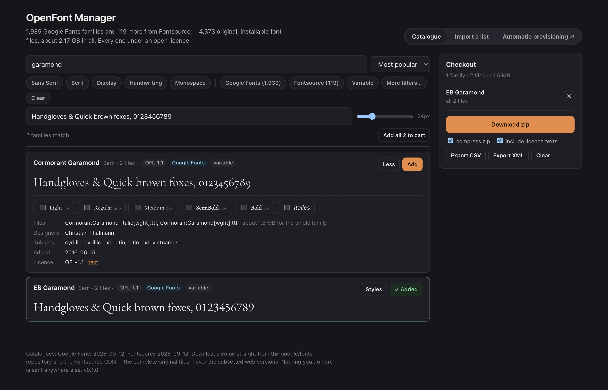

# OpenFont Manager

> **AI-assisted project.** This codebase was created with [Claude](https://claude.com/claude-code)
> (Anthropic), directed and reviewed by a human author. The browser download,
> the desktop install, the watched folder, a mounted-folder source and a
> WebDAV source with basic auth were each run end to end on macOS against
> real downloads. The installers the release workflow builds were then put
> through the same paces on a Windows 11 VM and an Ubuntu 24.04 VM: silent
> install, a headless `--install` (files in the per-user font folder, the
> registry values Windows expects, fontconfig on Linux), an install from the
> checkout in the running app, the login item on and off, and a
> `--background` launch that stays in the tray and runs its startup pass.
> What has **not** been run is a real login with the item enabled, and a
> real SMB or NFS share (the share source was proved on a local folder and a
> WebDAV server). Check it on a spare machine before a show depends on it.

Browse, preview and bulk-download open-source fonts — every Google Fonts
family, plus the ones Fontsource carries that Google does not — or hand it a
CSV, XML or text list. As a desktop app it installs them for you: from the
checkout, from a folder it watches, from a network share, at login, on a
timer, with no administrator password.

Everything in the browser version happens in the browser. Nothing you do is
sent anywhere except the two font CDNs.



<sub>The browser catalogue searched for “garamond”: Cormorant Garamond opened to its weights, files, designer and licence, EB Garamond already in the checkout, and the zip about to be built from the original TTFs.</sub>

---

## What it does

**A catalogue of 2,058 families** — 1,939 Google Fonts families with
downloadable files and 119 more from Fontsource (Adwaita, Aileron, Chunk
Five, …). Search by name or designer; filter by category, source, licence,
script subset, variable axes, italics; sort by popularity, name or date
added. Every card renders your own sample text in the actual face, loaded
lazily as it scrolls into view.

**The files are the real ones.** Downloads come from the `google/fonts`
repository on GitHub (mirrored by jsDelivr) and the Fontsource CDN — the
complete, original TTFs. *Not* the Google CSS API, which serves woff2
subsetted by unicode-range: a subsetted font installs cleanly and then
renders blanks outside its subset. The CSS API is used for the previews, and
only for the previews. See [AGENTS.md](AGENTS.md) §2.

**A checkout.** Add families whole, or open *Styles* and pick weights and
italics. Download as one zip — streamed straight to disk on Chrome and Edge,
so pulling the entire catalogue (about 2.2 GB, 4,373 files) costs no memory;
built in memory and split into parts on browsers that cannot stream. The zip
carries one folder per family with its licence text, a `MANIFEST.txt` of
provenance and licence for every file, and installer scripts for macOS,
Windows and Linux that write to the per-user font directory. Export the
checkout as a CSV or XML list to hand to another machine.

**Lists.** Drop a `.csv`, `.xml` or `.txt` on the import tab and it resolves
every name against the catalogue, tolerating case, punctuation and a
trailing style word (`Poppins-Bold` finds Poppins). Names it cannot find get
suggestions — and for the proprietary fonts a document is most likely to
name, an open stand-in: Carlito for Calibri, Arimo for Arial, Tinos for Times
New Roman, Caladea for Cambria, Cousine for Courier New, Gelasio for Georgia
(all metric-compatible, same widths, no reflow), and merely similar faces
for Segoe UI, Helvetica Neue, Garamond and the rest, labelled as such.

**The desktop app** is this same interface plus the four things a web page
cannot do:

- **Install** straight from the checkout into your user font folder, and
  tell the OS about it so the font is usable immediately (CoreText
  registration on macOS, the per-user registry key plus `AddFontResource`
  on Windows, `fc-cache` on Linux). Files already present are never
  overwritten.
- **A watched folder.** Any list placed in it is fetched and installed on
  the next pass. Lists are remembered by content hash, so one is processed
  once and again only if it changes.
- **Start at login**, hidden in the tray, running a pass on startup and on
  an interval you choose.
- **Network sources.** Add an SMB, NFS or WebDAV share the OS has mounted as
  a folder, or a WebDAV URL directly (username and password go in the
  system keychain). Font files found on it — any depth — are installed as
  they appear, and lists on it are processed like the watched folder. One
  folder on a NAS provisions every machine that runs the app.

---

## Lists

Three formats, detected by extension or content. The same names resolve the
same way in the browser, the desktop app and the headless command line.

**CSV** — only `family` is required; the header row is optional and the
columns may be in any order. Weights are numbers or style words separated by
`;` or spaces (never a comma); blank or `all` takes the whole family.
`italic` is yes/no; `source` is `google`, `fontsource` or blank for either.

```csv
family,weights,italic,source
Poppins,400;700,yes,google
Inter,all,,
"Playfair Display",700,no,
Adwaita Sans,,,fontsource
```

**XML** — any root element; one `<font>` per family, with the same four
fields as attributes, as child elements, or the name as text.

```xml
<fonts>
  <font family="Poppins" weights="400 700" italic="true"/>
  <font>Inter</font>
  <font name="Playfair Display"><weight>700</weight></font>
</fonts>
```

**TXT** — one family name per line; `#` starts a comment.

A whole family includes its italics. A specific weight list does not unless
`italic` says so. The three files under [`examples/`](examples/) are parsed
by both test suites, so the two implementations cannot drift apart.

---

## Automatic provisioning

The recipe for a fleet of presentation machines is in
[docs/PROVISIONING.md](docs/PROVISIONING.md). The short version:

1. Install the desktop app on each machine and open **Automatic
   provisioning**.
2. Tick **Start at login** and **Sync when the app starts**; pick an
   interval.
3. Either choose a **watched folder** and drop lists in it, or **add a
   source**: the mounted share (`/Volumes/fonts`, `\\nas\fonts`,
   `/mnt/fonts`) or a WebDAV URL. Press **Test** — it reports how many font
   files and lists it can see.
4. Put fonts and lists on the share. Every machine installs what is new on
   its next pass.

Sync is additive: a font removed from the share is not uninstalled. A file
that already exists in the font folder under the same name is never
replaced, so to ship a new version of a font, ship it under a new filename.

Headless, for scripts and login hooks:

```
openfont-manager --sync              one pass with no window; exit 1 if anything failed
openfont-manager --install list.csv  fetch and install one list, then exit
openfont-manager --background        start hidden in the tray (what the login item runs)
```

Settings live in `settings.json` under the app's config directory, state
(`state.json`) and `sync.log` under its data directory; both paths are shown
at the bottom of the provisioning panel. `OPENFONT_HOME` overrides both and
`OPENFONT_INSTALL_DIR` overrides the font folder.

---

## Running it

```bash
npm install
npm run dev            # browser app on http://localhost:5173
npm test               # 32 vitest tests, offline
npm run build          # tsc + vite -> dist/

npm run desktop:dev    # Tauri dev build (needs Rust)
npm run desktop:build  # installers under src-tauri/target/release/bundle
cargo test --manifest-path src-tauri/Cargo.toml   # 21 Rust tests, offline
```

The catalogues are build-time snapshots; `npm run catalogue` regenerates
both (Google first, then Fontsource, which reads the Google one to know what
to leave out). The app works with a stale catalogue, it just will not know
about newly added families.

---

## Licence

MIT. The fonts are not part of this project and carry their own licences —
OFL-1.1, Apache-2.0, UFL-1.0, MIT, CC0 — every one of which permits
installing and redistributing them. Each family's licence text travels with
its files.
